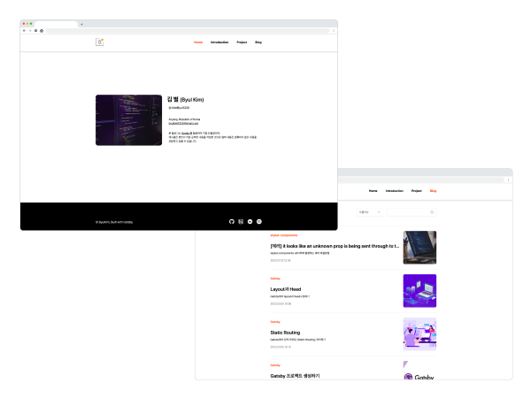
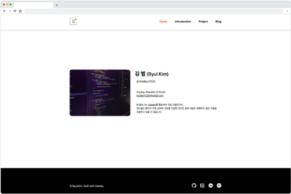
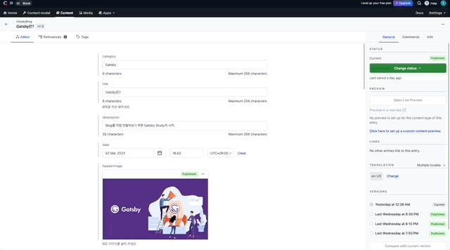
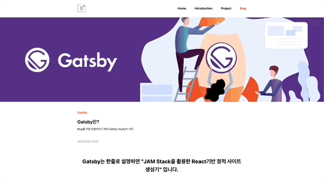
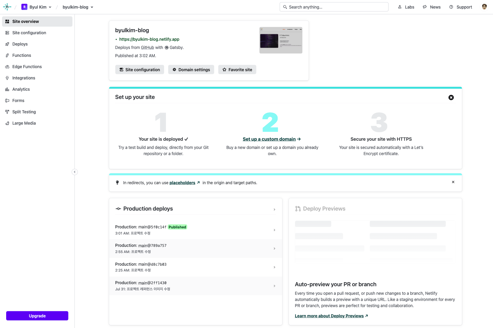
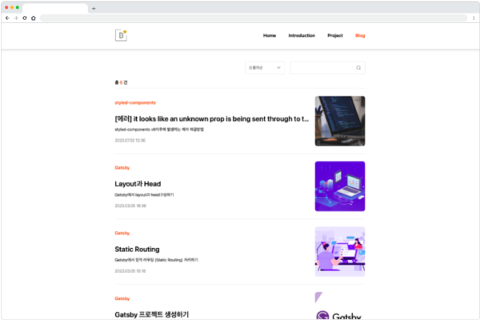

# Gatsby Blog
 

 
<a display="block" href="https://byulkim-blog.netlify.app">https://byulkim-blog.netlify.app</a>
  

 

## 화면구성 🖥

 

## Stacks 🧑🏻‍💻
### Environment

### Config
        
### Development
 

 

### Style
 

### Configuration Management & Deploy

    
 

## Project Detail 💻
### 1. Gatsby를 사용
- 해당 프로젝트는 React기반 오픈소스 프레임워크인 Gatsby를 사용하여 만든 Blog입니다.

 

### 2. Contentful 사용
- CMS는 Contentful을 연동하였으며, 이로인해 Blog 게시물을 Contentful을 통해 작성할 수 있습니다.

 

 

### 3. Build hook사용
- Build hook사용을 통해 Contentful에서 게시글 작성시 netlify에서 자동 빌드 및 배포되도록 설정.

 

 

### 4. 모바일 디바이스 대응
- 반응형작업을 통해 모바일 디바이스 사이즈 대응.

 
